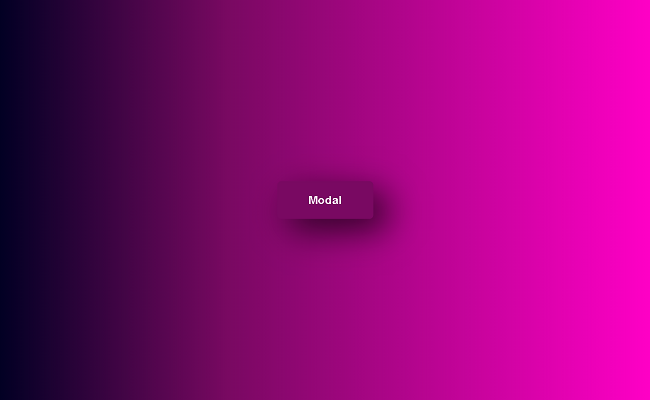
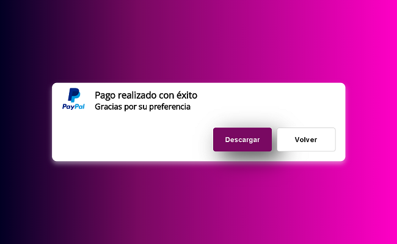

# React - Fundamentos

## Tecnologías Utilizadas:

- React (useState)
- ViteJs
- Sass
- Git

---
## Descripción 📘 

Proyecto simple para emplear un modal, condicionando la vista del componente de acuerdo al Hook useState, que setea un booleano y en función de esto, la vista o no del componente en cuestión. Sencillo y práctico para futuras implementaciones.

---
## Vista Principal 🎨
---

